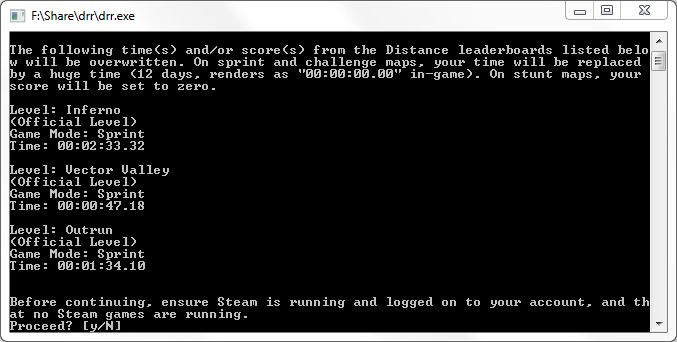

# distance-record-rm

A tool for removing [Distance](http://survivethedistance.com/) global leaderboard times/scores you set.

To prevent misuse, this tool requires you to obtain a special file from me on each use.

## Usage Steps:

1. If you haven't already done so, download `drr.zip` from the [releases](https://github.com/Seeker14491/distance-record-rm/releases) page and extract it somewhere. (Windows 64-bit only; let me know if you need another platform)
2. Send me a Discord message (Seekr#3274) telling me what times/scores you want to remove.
3. I'll then upload a `*.bin` file, which you need to download.
4. Drag and drop the `*.bin` file on top of `drr.exe` from the extracted zip. A window should appear that looks like this:

5. Follow the instructions in the window regarding Steam, then press `y` to continue. If everything goes well, `Success!` will be printed at the bottom of the window.
